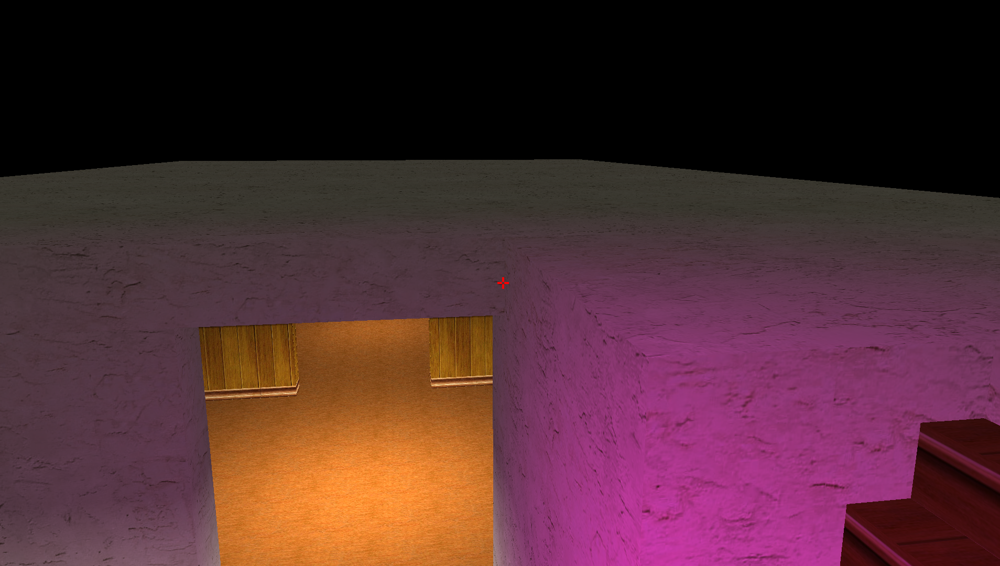

### REQUIREMENTS ###
Shader taken from
https://deepworldgame.wordpress.com/2016/09/24/monogame-shaders-part-i-ambient-point-lights/# Monogame First Person Game Example

## Features
* First person camera
* Collision
* Gravity
* Block-based
* Lighting

My first attempt at creating a 3D game engine in Monogame. Contains a fairly lousy .map importer which was used to create the house in Valve Hammer Editor.

Shader taken from
* [Deepworld Development Blog](https://deepworldgame.wordpress.com/2016/09/24/monogame-shaders-part-i-ambient-point-lights/)